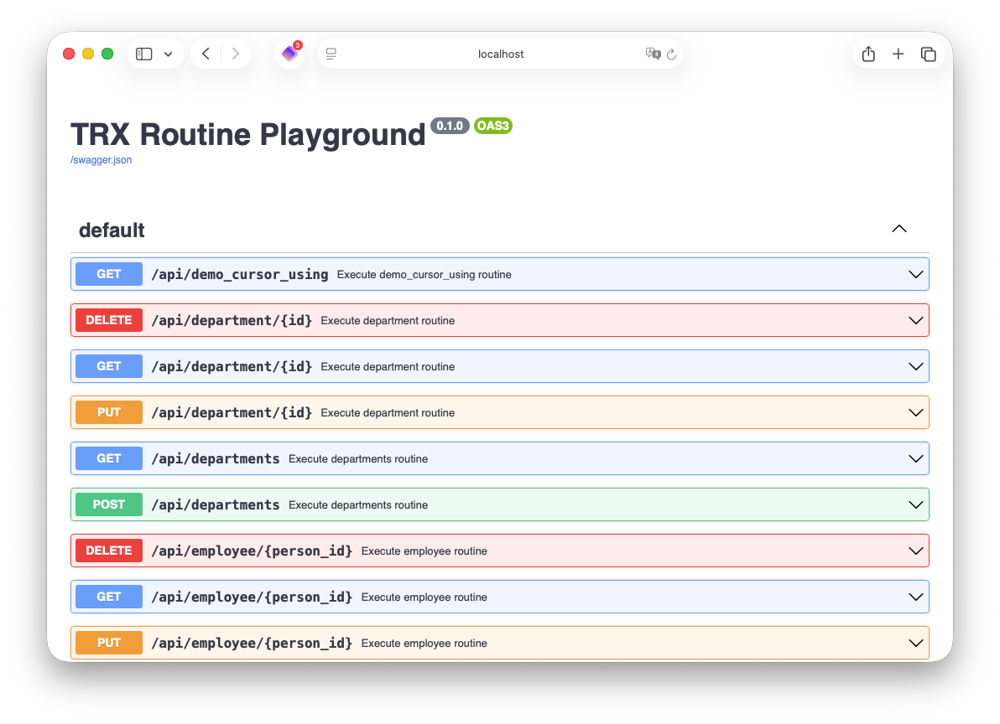

```
████████╗██████╗ ██╗  ██╗
╚══██╔══╝██╔══██╗╚██╗██╔╝
   ██║   ██████╔╝ ╚███╔╝
   ██║   ██╔══██╗ ██╔██╗
   ██║   ██║  ██║██╔╝ ██╗
   ╚═╝   ╚═╝  ╚═╝╚═╝  ╚═╝
```

# TRX - Transaction Processing Language

TRX is a domain-specific language for transaction processing, designed for building reliable database applications with explicit data structures, control flow, and error handling.

---

## Project Status

[](https://github.com/HarryKodden/trx/actions/workflows/ci.yml)
[](https://github.com/HarryKodden/trx/blob/main/LICENSE)
[](https://github.com/HarryKodden/trx/releases)
[](https://en.cppreference.com/w/cpp/20)
[](https://cmake.org/)

---

## Features

TRX provides a comprehensive set of features for transaction processing:

### Core Language Features
- **Strong Typing**: Record types, lists, and built-in types (INTEGER, CHAR, BOOLEAN, DECIMAL, etc.)
- **Automatic Type Definition**: Generate record types automatically from existing database table schemas using `TYPE name FROM TABLE table_name`
- **Variables and Constants**: Global and local variable declarations with type safety (explicit declarations required)
- **Routines**: Modular code organization with input/output parameters
- **Control Flow**: IF-ELSE, WHILE loops, and SWITCH statements with CASE/DEFAULT
- **Exception Handling**: TRY-CATCH blocks and THROW statements for error management
- **SQL Integration**: Direct SQL execution with host variables, cursors, and transaction management
- **HTTP API Integration**: Built-in HTTP client for making REST API calls with JSON request/response handling
- **Built-in Functions**: String manipulation (substr), list operations (len, append), logging (debug, info, error), HTTP requests (http)
- **Modules**: INCLUDE statements for code organization across multiple files (allows duplicate identical type definitions)

### Runtime Features
- **Database Connectivity**: Support for SQLite, PostgreSQL, and ODBC connections
- **Transaction Management**: Automatic transaction handling with rollback on errors
- **HTTP API Client**: Built-in HTTP client for making REST API calls with JSON serialization
- **REST API Server**: Built-in HTTP server for exposing **exported** routines as web services
- **JSON Serialization**: Automatic conversion between TRX records and JSON

## Grammar Overview

TRX uses a Pascal-like syntax with SQL integration:

```trx
TYPE PERSON {
    ID INTEGER;
    NAME CHAR(64);
    AGE INTEGER;
}

TYPE EMPLOYEE FROM TABLE employee;

CONSTANT MAX_AGE 100;
CONSTANT MIN_SALARY 50000.00;
CONSTANT COMPANY_NAME "TRX Corporation";
CONSTANT IS_PRODUCTION TRUE;

ROUTINE calculate_bonus(person: PERSON): PERSON {
    VAR result := person;
    IF person.AGE > 50 THEN {
        result.AGE := person.AGE + 10;
    }
    RETURN result;
}

ROUTINE process_data() {
    VAR employees LIST(PERSON);
    
    EXEC_SQL SELECT ID, NAME, AGE FROM employees;
    
    WHILE SQLCODE = 0 {
        VAR emp PERSON;
        FETCH emp FROM employees_cursor;
        
        TRY {
            calculate_bonus(emp);
        } CATCH {
            THROW "Processing failed";
        }
    }
}

EXPORT ROUTINE send_notification() {
    VAR request_config JSON := {
        "method": "POST",
        "url": "https://api.example.com/notify",
        "headers": {
            "Content-Type": "application/json",
            "Authorization": "Bearer " + api_token
        },
        "body": {
            "message": "Processing completed",
            "timestamp": timestamp
        },
        "timeout": 30
    VAR request_config JSON := {
        "method": "POST",
        "url": "https://api.example.com/notify",
        "headers": {
            "Content-Type": "application/json",
            "Authorization": "Bearer " + api_token
        },
        "body": {
            "message": "Processing completed",
            "timestamp": timestamp
        },
        "timeout": 30
    };
    
    VAR response JSON := http(request_config);
    
    IF response.status = 200 {
        trace("Notification sent successfully");
    } ELSE {
        THROW "Failed to send notification: " + response.status;
    }
}

EXPORT METHOD GET ROUTINE get_employee/{id}(id: INTEGER) : EmployeeOutput {
    // RESTful API with path parameters
    // Path parameters are bound to explicit function parameters
    var result EmployeeOutput := find_employee(id);
    RETURN result;
}
```

### Automatic Type Definition from Database Tables

TRX supports automatic generation of record types from existing database table schemas, eliminating code duplication:

```trx
-- Define a type automatically from the 'person' table schema
TYPE PERSON FROM TABLE person;

-- The type will have fields matching the database table:
-- - id: INTEGER (primary key)
-- - name: CHAR(64) (from VARCHAR(64))
-- - age: INTEGER
-- - active: BOOLEAN
-- - salary: DECIMAL(10,2)
```

This feature introspects the database at runtime and creates the appropriate TRX record type with correct field types, lengths, and constraints.

### HTTP API Integration

TRX provides built-in HTTP client functionality for making REST API calls with full JSON request/response handling:

```trx
ROUTINE api_call_example() {
    VAR request_config JSON := {
        "method": "POST",
        "url": "https://jsonplaceholder.typicode.com/posts",
        "headers": {
            "Content-Type": "application/json",
            "User-Agent": "TRX-Client/1.0"
        },
        "body": {
            "title": "Sample Post",
            "body": "This is a test post",
            "userId": 1
        },
        "timeout": 10
    };
    
    VAR response JSON := http(request_config);
    
    IF response.status = 201 {
        trace("Post created with ID: " + response.body.id);
    } ELSE {
        error("API call failed with status: " + response.status);
    }
}

ROUTINE get_user_data(): JSON {
    VAR request_config JSON := {
        "method": "GET",
        "url": "https://jsonplaceholder.typicode.com/users/1",
        "headers": {
            "Accept": "application/json"
        },
        "timeout": 5
    };
    
    VAR response JSON := http(request_config);
    
    IF response.status = 200 {
        VAR user JSON := response.body;
        VAR result JSON := {
            "name": user.name,
            "email": user.email,
            "company": user.company.name
        };
        RETURN result;
    } ELSE {
        THROW "Failed to fetch user data";
    }
}
```

**HTTP Request Configuration:**
- `method`: HTTP method (GET, POST, PUT, DELETE, PATCH, HEAD, OPTIONS)
- `url`: Target URL (supports query parameters)
- `headers`: Optional HTTP headers as JSON object
- `body`: Optional request body as JSON (automatically serialized)
- `timeout`: Request timeout in seconds (default: 30)

**HTTP Response Structure:**
- `status`: HTTP status code (number)
- `headers`: Response headers as JSON object
- `body`: Response body parsed as JSON

### Key Constructs
- **Declarations**: TYPE (manual or from table), CONSTANT, VAR, ROUTINE, ROUTINE
- **Statements**: Assignment (:=), SQL execution, HTTP requests, control flow, calls
- **Expressions**: Arithmetic, comparison, logical, function calls, field access, JSON objects
- **SQL**: EXEC_SQL, cursors (DECLARE, OPEN, FETCH, CLOSE), host variables (:var)
- **HTTP**: http() function with JSON configuration for REST API calls

---

## Usage

### Command Line Options

```bash
# Compile and validate a TRX file
trx source.trx

# Execute a specific routine
trx --routine routine_name source.trx

# Start REST API server
trx serve --port 8080 source.trx

# List available routines in a file
trx list source.trx
```

### Run Options

- `trx <source.trx>`: Parse and validate the TRX source file
- `trx --routine <name> <source.trx>`: Execute a specific routine
- `trx serve [options] <sources...>`: Start HTTP server exposing routines as REST endpoints
  - `--port <port>`: Server port (default: 8080)
  - `--routine <name>`: Only expose specific routine (default: all)
- `trx list <source.trx>`: List all routines defined in the file

### Database Connection Options

TRX supports multiple database backends:

- **SQLite** (default):
  - `--db-type sqlite`
  - `--db-connection <path>` (default: `:memory:`)
  - Environment: `DATABASE_TYPE=SQLITE`, `DATABASE_CONNECTION_STRING=<path>`

- **PostgreSQL**:
  - `--db-type postgresql`
  - `--db-connection "<host=localhost port=5432 user=user dbname=db>"`
  - Environment: `DATABASE_TYPE=POSTGRESQL`, `DATABASE_CONNECTION_STRING=<conn_str>`

- **ODBC**:
  - `--db-type odbc`
  - `--db-connection "<DSN=my_dsn;UID=user;PWD=pass>"`
  - Environment: `DATABASE_TYPE=ODBC`, `DATABASE_CONNECTION_STRING=<conn_str>`

### REST API Server

When running in serve mode, TRX automatically generates REST endpoints for each **exported** routine:

```bash
# Start server
trx serve --port 8080 examples/sample.trx

# Call routine via HTTP POST
curl -X POST http://localhost:8080/process_employee \
  -H "Content-Type: application/json" \
  -d '{"ID": 1, "NAME": "John", "AGE": 30}'
```

#### Swagger

All **exported routines** (see below) are listed in the Swagger page that you can open in the browser:



#### Exporting Routines

By default, routines are not exposed via the REST API. To make a routine available as a web service, use the `EXPORT` keyword:

```trx
TYPE EmployeeInput {
    ID INTEGER;
    NAME CHAR(64);
}

TYPE EmployeeOutput {
    ID INTEGER;
    NAME CHAR(64);
    BONUS DECIMAL;
}

ROUTINE internal_calculation(input: EmployeeInput) : EmployeeOutput {
    // This routine is internal only
    var result EmployeeOutput := { ID: input.ID, NAME: input.NAME, BONUS: 0 };
    RETURN result;
}

EXPORT ROUTINE process_employee(input: EmployeeInput) : EmployeeOutput {
    // This routine is exposed via REST API at /process_employee
    var result EmployeeOutput := internal_calculation(input);
    result.BONUS := result.ID * 0.1; // 10% bonus
    RETURN result;
}
```

You can customize the HTTP method and response headers for exported routines:

```trx
EXPORT METHOD GET ROUTINE get_employee(id: EmployeeId) : EmployeeOutput {
    // Exposed as GET /get_employee
    var result EmployeeOutput := find_employee(id.ID);
    RETURN result;
}

EXPORT METHOD POST HEADERS {
    "X-API-Version": "1.0";
    "Cache-Control": "no-cache";
} ROUTINE create_employee(input: EmployeeInput) : EmployeeOutput {
    // Exposed as POST /create_employee with custom headers
    var result EmployeeOutput := create_employee_record(input);
    RETURN result;
}
```

For functions that return data, use `EXPORT ... ROUTINE`:

```trx
EXPORT METHOD PUT HEADERS {
    "Content-Type": "application/json";
} ROUTINE update_employee(id: EmployeeId, input: EmployeeInput) : EmployeeOutput {
    // Exposed as PUT /update_employee
    var result EmployeeOutput := update_employee_record(id.ID, input);
    RETURN result;
}
```

Supported HTTP methods: `GET`, `POST`, `PUT`, `DELETE`, `PATCH`, `HEAD`, `OPTIONS`

#### Path Parameters in Routine Names

TRX supports RESTful URL patterns with path parameters directly in routine names. Path parameters are specified using curly braces `{}` and are automatically extracted from the URL and passed to the routine:

```trx
EXPORT METHOD GET ROUTINE get_employee/{id}(id: INTEGER) : EmployeeOutput {
    // Exposed as GET /get_employee/{id}
    // Path parameters are bound to explicit function parameters
    var result EmployeeOutput := find_employee(id);
    RETURN result;
}

EXPORT METHOD GET ROUTINE get_category_item/{category}/{id}(category: CHAR, id: INTEGER) : ItemOutput {
    // Exposed as GET /get_category_item/{category}/{id}
    // Multiple path parameters are bound to explicit function parameters
    var result ItemOutput := find_item(category, id);
    RETURN result;
}

EXPORT METHOD PUT ROUTINE update_employee/{id}(id: INTEGER, updates: EmployeeInput) : EmployeeOutput {
    // Exposed as PUT /update_employee/{id}
    // Path parameter 'id' and body parameter 'updates' are both available
    var result EmployeeOutput := update_employee_record(id, updates);
    RETURN result;
}
```

**Path Parameter Rules:**
- Path parameters are specified in the routine name using `{parameter_name}` syntax
- Functions with path parameters must declare explicit parameters matching the path parameter names
- Multiple path parameters are supported: `/routine/{param1}/{param2}`
- Path parameters are automatically bound to the declared function parameters
- Request body parameters (if any) are passed as additional function parameters

**Example API Calls:**

```bash
# Get employee by ID
curl -X GET http://localhost:8080/get_employee/123

# Get item by category and ID  
curl -X GET http://localhost:8080/get_category_item/electronics/456

# Update employee (path param + body)
curl -X PUT http://localhost:8080/update_employee/123 \
  -H "Content-Type: application/json" \
  -d '{"NAME": "Updated Name", "AGE": 35}'
```

The server provides:
- Automatic JSON request/response handling
- Swagger/OpenAPI documentation at `/swagger.json`
- Error handling with proper HTTP status codes
- Custom HTTP methods and response headers
- Only `EXPORT` routines are exposed as REST endpoints

---

## Building and Testing

### Prerequisites

- CMake 3.22+
- C++20 compiler (AppleClang 17+, GCC 11+, MSVC 2022+)
- Bison 3.7+ and Flex 2.6+
- SQLite3 development headers
- Optional: PostgreSQL and ODBC development headers

### Quick Build

```bash
# Using Make (recommended)
make build        # Configure and build
make test         # Run tests
make examples     # Verify examples compile

# Or using CMake directly
cmake -S . -B build -G Ninja -DCMAKE_BUILD_TYPE=Release
cmake --build build
cd build && ctest --output-on-failure
./src/trx examples/sample.trx
```

### Docker Build

```bash
# Build development image
docker build --target builder -t trx-dev .

# Build runtime image
docker build -t trx-runtime .

# Run tests
docker run --rm -v "$PWD":/workspace trx-dev \
  bash -c 'cd /workspace && cmake -S . -B build -G Ninja && cmake --build build && cd build && ctest'

# Run compiler
docker run --rm -v "$PWD":/workspace trx-runtime /workspace/examples/sample.trx

# Start server
docker run --rm -v "$PWD":/workspace -p 8080:8080 trx-runtime serve /workspace/examples/sample.trx
```

### Load Testing

TRX includes a comprehensive load testing tool to verify API behavior under heavy concurrent load:

```bash
# Quick test - 100 requests, 10 concurrent users
make load-test-quick

# Medium load - 1000 requests, 20 concurrent users
make load-test-medium

# Heavy load - 10000 requests, 50 concurrent users  
make load-test-heavy

# Custom configuration
make load-test ARGS="-n 5000 -c 30 -d 60"
```

The load tester:
- Randomly generates valid data for all API endpoints (PERSON, DEPARTMENT, EMPLOYEE)
- Tests all CRUD operations with weighted distributions (more GETs than POSTs/DELETEs)
- Tracks response times (min/max/mean/median/P95/P99) and success rates
- Intelligently reuses created resource IDs for realistic scenarios
- Supports duration-based or count-based testing

See [tools/LOAD_TESTING.md](tools/LOAD_TESTING.md) for detailed usage and configuration options.

### Monitoring with Prometheus & Grafana

TRX includes an integrated monitoring stack for real-time performance visualization:

```bash
# Start TRX server with Prometheus and Grafana
docker compose up -d

# Access the monitoring interfaces
# - Grafana Dashboard: http://localhost:3000 (admin/admin)
# - Prometheus: http://localhost:9090
# - TRX Metrics: http://localhost:8080/metrics
```

The monitoring stack provides:
- **Real-time metrics**: Request rates, response times, error rates, active requests
- **Pre-built Grafana dashboard**: "TRX Server Performance" with 8 visualization panels
- **Prometheus metrics**: Standard `/metrics` endpoint for integration with other tools
- **7-day retention**: Historical data for trend analysis
- **Auto-refresh**: Dashboard updates every 5 seconds

Perfect for:
- Visualizing load test results in real-time
- Monitoring production performance
- Identifying bottlenecks and optimization opportunities
- Tracking service health and SLA compliance

See [docs/MONITORING.md](docs/MONITORING.md) for detailed setup and usage.

---

## Examples

See the `examples/` directory for sample TRX programs:

- `sample.trx`: Comprehensive example showing records, routines, SQL operations, and control flow
- `init.trx`: Database initialization and automatic type definition from tables
- `exception_test.trx`: Error handling with TRY/CATCH and THROW statements
- `global_test.trx`: Global variables and function definitions
- `json_test.trx`: JSON data structures and manipulation
- `http_demo.trx`: HTTP API integration with GET and POST requests

---

## 🔧 CI/CD & Code Quality

### Continuous Integration

TRX uses GitHub Actions for automated testing and deployment:

```yaml
# Key CI workflows include:
# - Multi-platform builds (Linux, macOS, Windows)
# - Comprehensive test suite execution
# - Code coverage reporting
# - Static analysis with clang-tidy
# - Memory leak detection with Valgrind
# - Docker image building and publishing
```

### Code Quality Metrics

- **Test Coverage**: >90% line and branch coverage
- **Static Analysis**: Zero clang-tidy warnings
- **Memory Safety**: Valgrind clean (no leaks or errors)
- **Performance**: Load testing with 10,000+ concurrent requests
- **Documentation**: 100% API documentation coverage

### Quality Gates

- ✅ All tests pass on all platforms
- ✅ Code coverage meets minimum thresholds
- ✅ No critical security vulnerabilities
- ✅ Performance benchmarks within acceptable ranges
- ✅ Documentation is up-to-date and accurate

---

## 📦 Releases & Docker Images

TRX uses GitHub Actions for automated releases and Docker image publishing:

### Creating a Release

```bash
# Interactive release creation
make release

# Or manually:
# 1. Update version in CMakeLists.txt
# 2. Commit changes
# 3. Create and push git tag
git tag -a v1.0.0 -m "Release v1.0.0"
git push origin v1.0.0
```

### Docker Images

Automated builds publish images to GitHub Container Registry:

- **Runtime Image**: `ghcr.io/harrykodden/trx:latest`
- **Development Image**: `ghcr.io/harrykodden/trx:latest-dev`

Tagged releases also create version-specific images:
- `ghcr.io/harrykodden/trx:v1.0.0`
- `ghcr.io/harrykodden/trx:v1.0.0-dev`

### Release Artifacts

Each release includes:
- Source code tarball (`.tar.gz`)
- Pre-built Linux binaries
- Docker images with multi-architecture support

---

## Architecture

TRX is built as a modular C++ project:

- **AST**: Immutable data structures for parsed code
- **Parsing**: Flex/Bison-based parser with semantic actions
- **Runtime**: Interpreter with symbol tables, database drivers, and execution engine
- **CLI**: Command-line interface and REST server
- **Diagnostics**: Structured error reporting

The design emphasizes testability, with comprehensive unit tests covering parsing, AST construction, and runtime execution.
