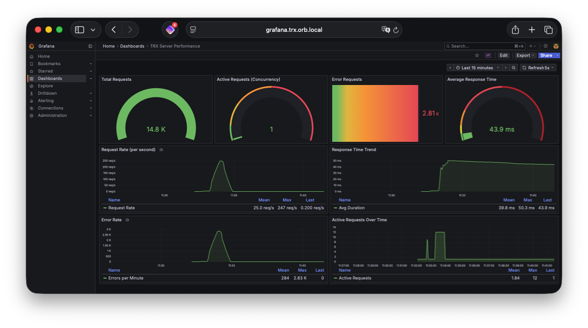

# TRX Monitoring with Prometheus & Grafana

This document explains how to use the integrated Prometheus and Grafana monitoring stack to visualize TRX server performance metrics.

## Overview

The TRX server exposes performance metrics at the `/metrics` endpoint in Prometheus format. These metrics are scraped by Prometheus and visualized in Grafana dashboards.

### Architecture

```
TRX Server (port 8080)
    ↓ /metrics endpoint
Prometheus (port 9090) - Scrapes metrics every 5s
    ↓ PromQL queries
Grafana (port 3000) - Visualizes metrics in dashboards
```

## Quick Start

### 1. Start the Monitoring Stack

```bash
# Start all services (PostgreSQL, TRX, Prometheus, Grafana)
docker compose up -d

# Or rebuild if needed
docker compose up -d --build
```

### 2. Access the Interfaces

- **TRX Server**: http://localhost:8080
  - Swagger UI: http://localhost:8080/swagger
  - Metrics endpoint: http://localhost:8080/metrics
  
- **Prometheus**: http://localhost:9090
  - Explore metrics and queries
  - Check targets: http://localhost:9090/targets
  
- **Grafana**: http://localhost:3000
  - **Username**: `admin`
  - **Password**: `admin`
  - Pre-configured dashboard: "TRX Server Performance"

### 3. View the Dashboard

1. Open Grafana at http://localhost:3000
2. Login with `admin` / `admin`
3. Navigate to **Dashboards** → **TRX Server Performance**
4. The dashboard auto-refreshes every 5 seconds


## Available Metrics

The TRX server exposes the following Prometheus metrics:

### `trx_total_requests` (Counter)
Total number of HTTP requests processed since server start.

**Usage**: Track overall request volume and calculate request rates.

```promql
# Request rate per second
rate(trx_total_requests[1m])

# Total requests in last hour
increase(trx_total_requests[1h])
```

### `trx_active_requests` (Gauge)
Number of currently in-flight requests being processed.

**Usage**: Monitor concurrent load and detect traffic spikes.

```promql
# Current active requests
trx_active_requests

# Maximum concurrent requests in last 5m
max_over_time(trx_active_requests[5m])
```

### `trx_error_requests` (Counter)
Total number of requests that resulted in HTTP 4xx or 5xx errors.

**Usage**: Track error rates and service reliability.

```promql
# Error rate per second
rate(trx_error_requests[1m])

# Error percentage
(rate(trx_error_requests[5m]) / rate(trx_total_requests[5m])) * 100
```

### `trx_average_duration_ms` (Gauge)
Rolling average response time in milliseconds.

**Usage**: Monitor performance and detect slowdowns.

```promql
# Current average response time
trx_average_duration_ms

# Response time change over last 10m
deriv(trx_average_duration_ms[10m])
```

## Dashboard Panels



The pre-configured "TRX Server Performance" dashboard includes:

### 1. Overview Stats (Top Row)
- **Total Requests**: Cumulative request count
- **Active Requests**: Current concurrent requests (yellow >5, red >10)
- **Error Requests**: Total error count (yellow >10, red >100)
- **Average Response Time**: Current avg latency in ms (yellow >100ms, red >500ms)

### 2. Request Rate Graph
Shows requests per second over time using `rate(trx_total_requests[1m])`.

**Use case**: Identify traffic patterns and load spikes.

### 3. Response Time Graph
Displays average response time trend over time.

**Use case**: Detect performance degradation and optimize slow endpoints.

### 4. Error Rate Graph
Shows error rate per second over time.

**Use case**: Quickly spot error spikes and service issues.

### 5. Active Requests Graph
Visualizes concurrent request load over time.

**Use case**: Understand concurrency patterns and capacity needs.

## Using with Load Testing

The monitoring stack is particularly useful when running load tests:

```bash
# Terminal 1: Start the stack
docker compose up -d

# Terminal 2: Run load test
make load-test-heavy

# Terminal 3: Watch metrics in real-time
watch -n 1 curl -s http://localhost:8080/metrics
```

Or view in Grafana:
1. Open http://localhost:3000
2. Go to "TRX Server Performance" dashboard
3. Run `make load-test-heavy` and watch metrics update live
4. Observe:
   - Request rate climbing during test
   - Active requests fluctuating based on concurrency
   - Average response time under load
   - Any error spikes indicating issues

## Prometheus Queries (PromQL)

### Common Queries

#### Calculate Success Rate
```promql
(1 - (rate(trx_error_requests[5m]) / rate(trx_total_requests[5m]))) * 100
```

#### Requests Per Minute
```promql
rate(trx_total_requests[1m]) * 60
```

#### P95 Response Time (Approximation)
Since we only have average, this estimates:
```promql
trx_average_duration_ms * 1.5
```

#### Peak Concurrent Requests (Last Hour)
```promql
max_over_time(trx_active_requests[1h])
```

#### Error Spike Detection
Alert when error rate exceeds threshold:
```promql
rate(trx_error_requests[5m]) > 1  # More than 1 error/second
```

## Configuration

### Prometheus Configuration

Edit `prometheus.yml` to adjust scraping:

```yaml
scrape_configs:
  - job_name: 'trx-server'
    scrape_interval: 5s      # How often to scrape (default: 5s)
    scrape_timeout: 4s       # Request timeout (default: 4s)
    static_configs:
      - targets: ['trx:8080']
```

### Grafana Configuration

- **Data retention**: Prometheus retains 7 days by default (configurable in docker-compose.yml)
- **Admin credentials**: Change in docker-compose.yml environment variables
- **Dashboard auto-refresh**: Set to 5s (adjustable in dashboard settings)

### Dashboard Customization

To modify the dashboard:

1. Open Grafana → Dashboards → TRX Server Performance
2. Click the gear icon (⚙️) → Settings
3. Click any panel title → Edit
4. Modify queries, thresholds, or visualization settings
5. Save dashboard

Or edit `grafana-dashboard.json` directly and restart:
```bash
docker compose restart grafana
```

## Alerting (Optional Enhancement)

While not configured by default, you can add alerting:

### Via Prometheus Alertmanager

1. Add alerting rules to `prometheus.yml`
2. Configure Alertmanager in docker-compose
3. Set up notification channels (email, Slack, PagerDuty)

Example alert rule:
```yaml
groups:
  - name: trx_alerts
    rules:
      - alert: HighErrorRate
        expr: rate(trx_error_requests[5m]) > 1
        for: 2m
        annotations:
          summary: "High error rate detected"
          description: "Error rate is {{ $value }} errors/sec"
```

### Via Grafana Alerts

1. Edit dashboard panel → Alert tab
2. Define alert conditions
3. Configure notification channels in Grafana settings

## Troubleshooting

### Prometheus not scraping TRX metrics

Check Prometheus targets:
```bash
curl http://localhost:9090/api/v1/targets
```

If status is "DOWN":
- Verify TRX server is running: `curl http://localhost:8080/metrics`
- Check docker network: `docker compose ps`
- Review Prometheus logs: `docker compose logs prometheus`

### Grafana shows "No data"

1. Verify Prometheus datasource:
   - Grafana → Configuration → Data sources → Prometheus
   - Click "Test" button
   
2. Check if metrics exist in Prometheus:
   - Open http://localhost:9090
   - Execute query: `trx_total_requests`
   
3. Verify time range in Grafana matches when metrics were generated

### Dashboard not appearing

```bash
# Restart Grafana to reload provisioning
docker compose restart grafana

# Check provisioning logs
docker compose logs grafana | grep -i provision
```

## Performance Considerations

### Metric Cardinality

The current implementation has **low cardinality** (only 4 metrics), which is excellent for performance. Avoid adding high-cardinality metrics (e.g., per-endpoint, per-user metrics) without aggregation.

### Storage Requirements

With 5-second scraping interval and 4 metrics:
- ~17,280 samples per day per metric
- ~69,120 total samples per day
- ~484,840 samples per week (7-day retention)
- Estimated storage: ~50MB per week

### Scrape Interval Tuning

- **5s**: Real-time monitoring, higher storage
- **15s**: Good balance (Prometheus default)
- **30s**: Lower storage, less granular data

Adjust in `prometheus.yml` based on your needs.

## Production Recommendations

When deploying to production:

1. **Secure Grafana**:
   - Change admin password
   - Enable HTTPS
   - Set up proper authentication (LDAP, OAuth)

2. **Prometheus Storage**:
   - Use persistent volumes (already configured)
   - Set up remote storage for long-term retention (Thanos, Cortex)
   - Increase retention beyond 7 days if needed

3. **Network Security**:
   - Don't expose Prometheus/Grafana ports publicly
   - Use reverse proxy with authentication
   - Consider network policies in Kubernetes

4. **Alerting**:
   - Set up Alertmanager for critical alerts
   - Configure PagerDuty/Slack integrations
   - Define SLO/SLA thresholds

5. **High Availability**:
   - Run multiple Prometheus instances
   - Use Grafana clustering
   - Set up load balancing

## Advanced Metrics (Future Enhancements)

Consider adding these metrics to the TRX server:

```cpp
// Per-endpoint metrics
trx_requests_by_endpoint{endpoint="/persons",method="GET"}

// Response time histogram (for percentiles)
trx_request_duration_seconds_bucket{le="0.1"}

// Database metrics
trx_db_connection_pool_size
trx_db_query_duration_seconds

// Resource metrics
trx_memory_usage_bytes
trx_goroutines_count (if applicable)
```

## Summary

The monitoring stack provides:

✅ **Real-time visibility** into TRX server performance  
✅ **Historical data** for trend analysis (7 days)  
✅ **Pre-built dashboard** for immediate insights  
✅ **Low overhead** (minimal performance impact)  
✅ **Easy integration** with load testing  
✅ **Production-ready** foundation for observability  

Access points:
- **Grafana Dashboard**: http://localhost:3000 (admin/admin)
- **Prometheus UI**: http://localhost:9090
- **TRX Metrics**: http://localhost:8080/metrics
